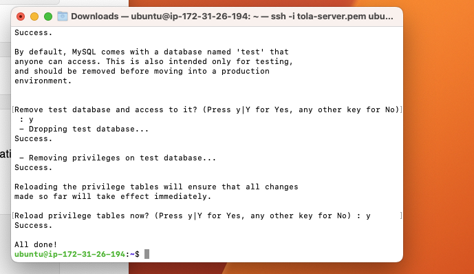
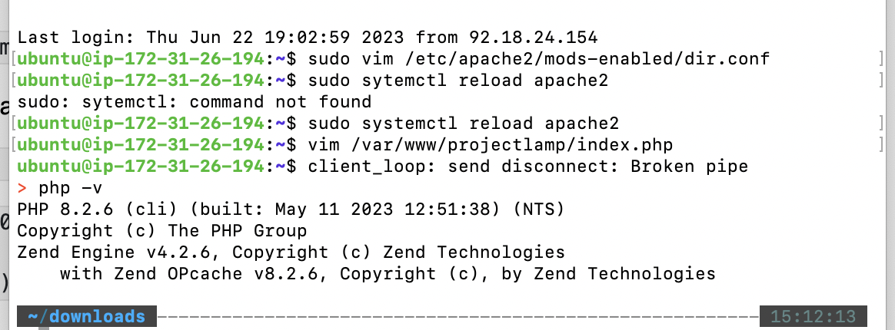
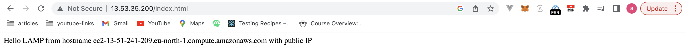
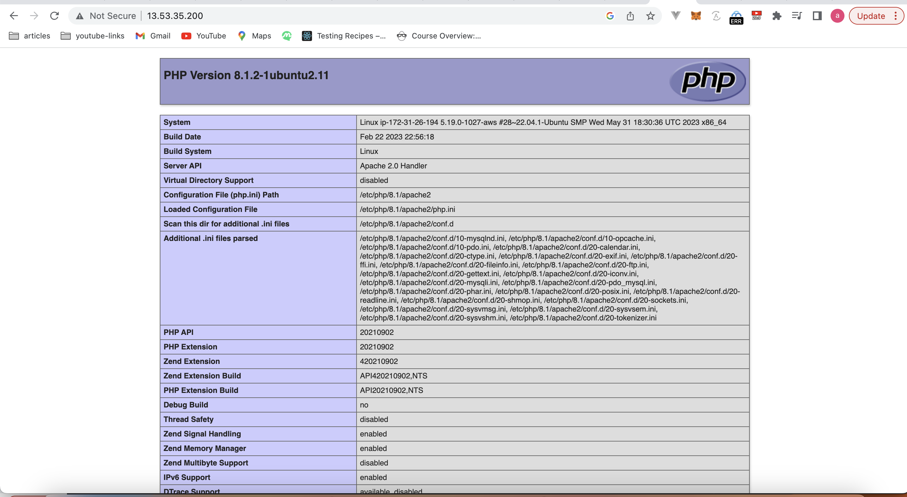

# Project1

# STEP 1

- Installing nginx web server
  - run _sudo apt update_ to update server's index package
  - run _sudo apt install nginx_ to install nginx server

# STEP 2

- Installing MYSQL
  - run _sudo apt install mysql-server_ to install sql server
  - run _sudo mysql_ to login to mysql console
  - run **_ALTER USER 'root'@'localhost' IDENTIFIED WITH mysql_native_password BY 'PassWord.1';_** to set password for the root user using mysql\*native_password as default authentication method.
  - exit MYSQL shell with \_msql > exit
  - run _sudo mysql_secure_installation_ to start the interactive script running and follow prompt to validate password.
  - With the steps above MYSQL server should be installed and secured.
    

# STEP 3

- Installing PHP
  - run _sudo apt install php libapache2-mod-php php-mysql_ to install php, libapache2-mod-php, php-mysql at once.
  - run _php -v_ to confirm php is installed.
    

# STEP 4

- Configuring nginxto use php processor

  - run _sudo mkdir /var/www/projectLEMP_ to create root web directory for your_domain.
  - run _sudo chown -R $USER:$USER /var/www/projectLEMP_ to assign ownership of the directory with the $USER environment variable, which will reference your current system user.
  - run _sudo nano /etc/nginx/sites-available/projectLEMP_ to open a configuration file in Nginx’s sites-available directory using your preferred command-line editor. Here, we’ll use nano.
  - Add the snippet in the code block below in the file
  - run _sudo ln -s /etc/nginx/sites-available/projectLEMP /etc/nginx/sites-enabled/_ to activate your configuration by linking to the config file from Nginx’s sites-enabled directory
  - run _sudo unlink /etc/nginx/sites-enabled/default_ to disable default Nginx host that is currently configured to listen on our port(80).
  - run _sudo systemctl reload nginx_ to apply changes.
  - visit _http://<Public-IP-Address>:80_ in the browser to see the website.

    ```
        server {
        listen 80;
        server_name projectLEMP www.projectLEMP;
        root /var/www/projectLEMP;

        index index.html index.htm index.php;

        location / {
            try_files $uri $uri/ =404;
        }

        location ~ \.php$ {
            include snippets/fastcgi-php.conf;
            fastcgi_pass unix:/var/run/php/php8.1-fpm.sock;
        }

        location ~ /\.ht {
            deny all;
        }

    }
    ```

  ```

  ```



# STEP 5

- If we want to serve index.php file as the root file, run _sudo vim /etc/apache2/mods-enabled/dir.conf_ and change the content to the snippet below. Save and close

```
<IfModule mod_dir.c>
        #Change this:
        #DirectoryIndex index.html index.cgi index.pl index.php index.xhtml index.htm
        #To this:
        DirectoryIndex index.php index.html index.cgi index.pl index.xhtml index.htm
</IfModule>
```

- run _sudo systemctl reload apache2_ to reload apache for the changes to take effect.
- run _vim /var/www/projectlamp/index.php_ to create index.php file in the web root folder. Paste the snippet below in the file.

```
<?php
phpinfo();
```

- save and close the file, refresh the page and you should see the image below.
  
